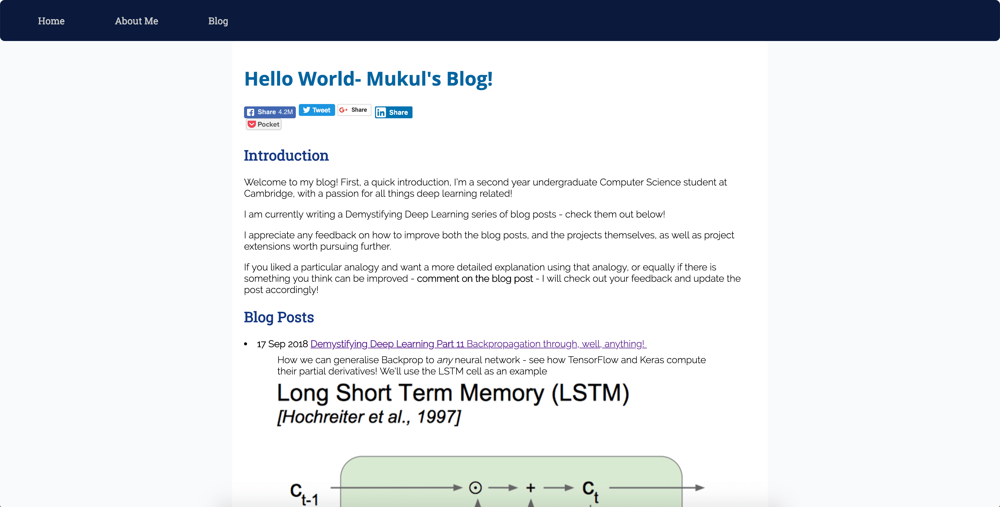
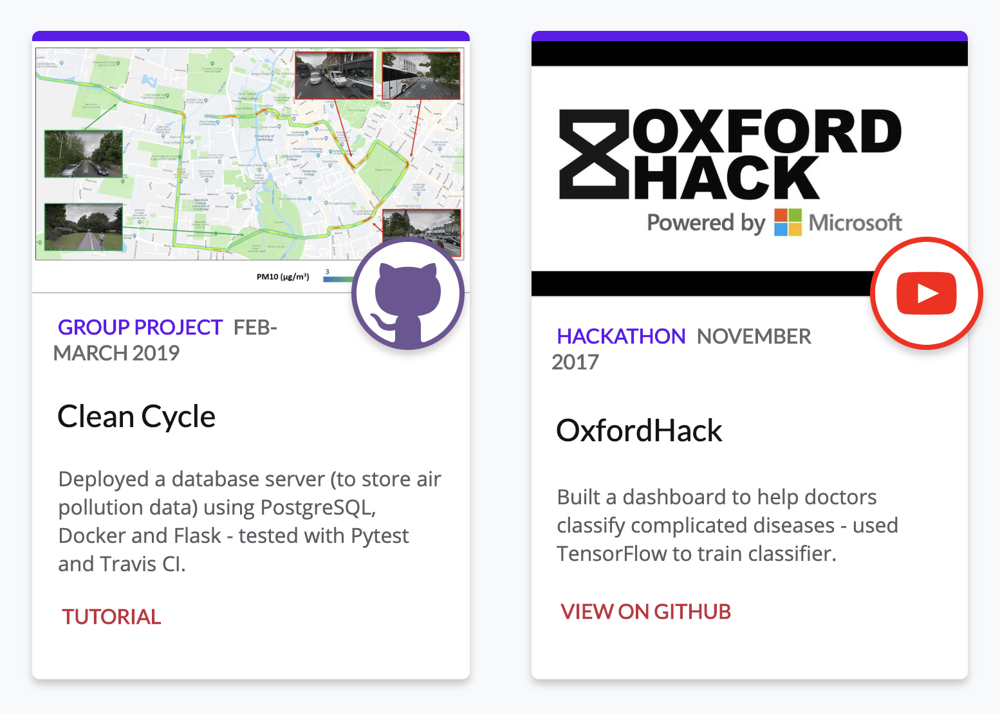
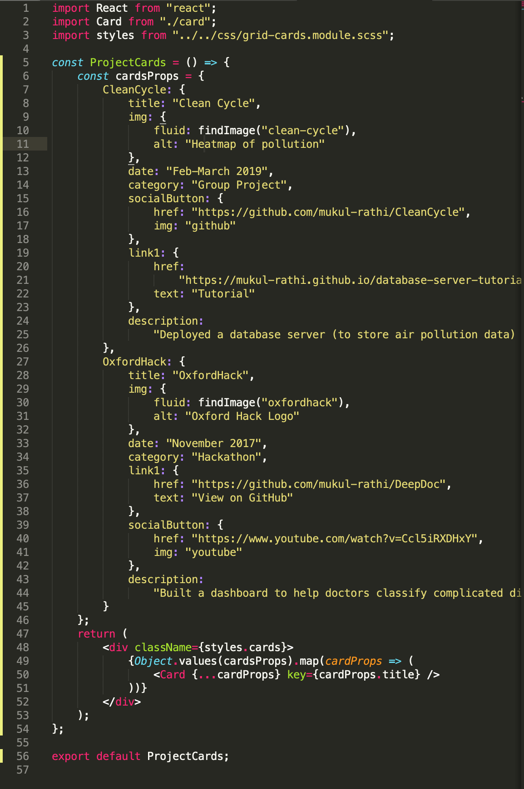
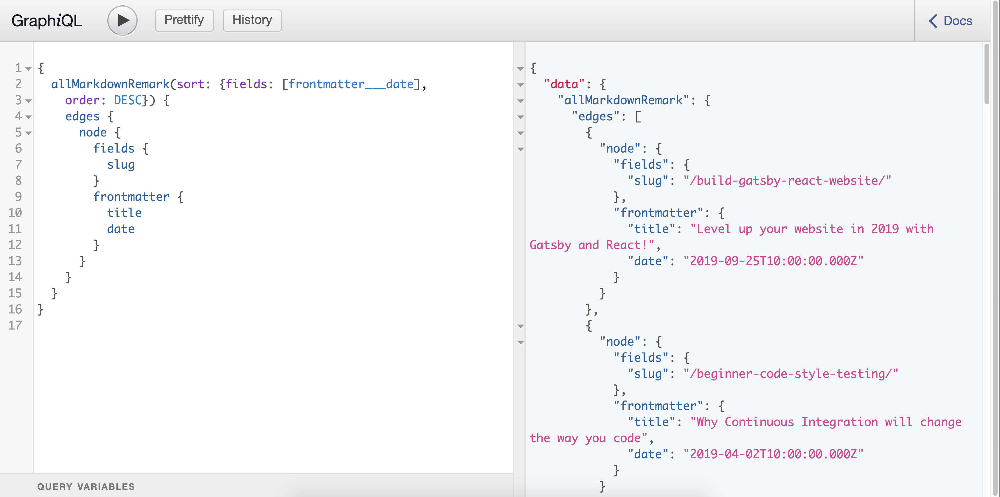

## Website v1.0 - Humble beginnings

From the start, my personal website has had two main purposes:

- A testbed to learn the latest and greatest web technologies
- A place on the internet for me to share the projects I've been working on and things I've learnt along the way.

This post is a bit meta, as the website itself has been a project I've been working on over the last year and a half!

Indeed I built the first version of the website during some downtime whilst running a hackathon during my first year at university. Having had no previous web experience, I decided the best way to learn HTML and CSS was to make my own website and tinker with it, and thus my website was born.

I used the static-site generator Jekyll to power my blog - with a HTML template for each post, and the contents of the post written in Markdown. This first version of the website was clean and simple, no bells or whistles.

### Outgrowing Jekyll

Around December last year, I decided to redesign my website to use a card-based design. I soon encountered some growing pains:

- **HTML Templates were unwieldy** - with a more sophisticated card-based layout, I wanted to reuse the rendering logic for the card rather than copy-pasting the HTML.
- **Website was slow to render** - images needed to be compressed and the browser took a long time to render the assets.
- **Jekyll was slow to live edit** - it would take a few seconds for the dev version of the website to re-render every time I edited a post.
- **Liquid templating language was clunky** - learning a whole new syntax just for this template was more hassle than using more familiar, and more powerful Javascript syntax.

## Website v2.0 - Enter Gatsby

> #### Gatsby is a blazing fast modern site generator for React, using GraphQL to pull in your data.

Let's break this description down:

### Blazing fast site generator

Run a Chrome Lighthouse audit on your site, and you will notice Gatsby sites load incredibly quickly - Gatsby loads only the critical HTML, CSS and other resources and then prefetches the other resources in the background - making the website feel extremely responsive.

Rather than having to deal with scaling databases or servers, and having the associating hosting costs, Gatsby automatically generates static HTML and minified CSS and JS files from your source code, as well as compressing any assets like images for you, all with the command `gatsby build`. These generated static files scale up well to increased web traffic - which will come in handy for whenever this blog takes off ;).

If that weren't easy enough, if you host with Netlify, then Netlify will automatically run this build step and deploy every time you push to your source-code git repository.

Running `gatsby develop` instead runs the localhost dev version of the site, which has **hot reloading** - it re-renders instantaneously when live-editing the code. This made it very easy to make small iterative changes to the site - much easier than Jekyll!

### Modern

The Javascript-powered stack uses the latest and greatest front-end UI library - React. Javascript syntax is far more powerful than the liquid templating language.

### React

React is a front-end Javascript library for rendering UIs. The key idea is **component-based design** - you package up all the rendering state and logic in one component, which you can then reuse. The JSX syntax for components is just like HTML tags, so it is easy to pick up if you have some prior web dev experience. The [React Docs](https://reactjs.org/docs/getting-started.html) are a wonderful resource, and the [React Dev Tools](https://chrome.google.com/webstore/detail/react-developer-tools/fmkadmapgofadopljbjfkapdkoienihi?hl=en) Chrome extension takes "Inspect Element" in the console to another level, so it is easy to debug.

React is a **game-changer** for web development, especially if you have standardised UI components in place. At my time at Facebook, the UI library was such that if I needed a particular behaviour or design - there's a component for that, and the best part was **encapsulation** of implementation details, so all I needed to do was pass the required props to the component and it just worked.

On my website, since cards feature heavily in the layout, I created a **Card** React Component which I can then reuse:

Here I don't need to worry about the underlying implementation for cards, and can reuse it for each of the projects. Components are composable, so this makes the project code easier to navigate, with shorter self-contained files for each of the components, rather than one massive HTML file.

### GraphQL

Gatsby allows you to pull data from a variety of sources when it bundles your website up and generates the HTML, whether that be pulling images from an assets folder, or markdown files for each of the blog posts.

GraphQL is the query language used to fetch the data - you specify the fields you want, and then are returned an object with only those fields, in the JSON format of the query.

This contrasts with REST APIs, where your GET request to an endpoint may _over-fetch_ data that you don't need, or worse _under-fetch_ data, forcing you to query multiple endpoints to get the data.

There's a great [ GraphQL tutorial](https://www.howtographql.com/) explaining this in more depth, and as a bonus there's even a helpful playground built into your Gatsby site (**GraphiQL**) that you can use to test out your queries.

Here, each markdown file is a Graph **node** and the nodes are connected by **edges** We sort the data in descending order of the date specified in the markdown frontmatter, and then return the URL slug, title and date fields of each of the files. What you ask for is exactly what the query returns!

### Killer Feature: The Plugin Ecosystem

Gatsby makes web development super easy - by not having to worry about all the moving parts, you can just focus on making the website look good.

You can take this up a notch by adding [plugins](https://www.gatsbyjs.org/plugins/) for additional functionality by just adding the respective node modules and specifying the plugins in the `gatsby-config.js` file.

Here are a few of the things you can do with plugins:

- Lazy load and blur up images - `gatsby-image` plugin.
- Make your site a Progressive Web App - just use `gatsby-plugin-manifest` and `gatsby-plugin-offline`.
- Use SASS rather than plain odd CSS - `gatsby-plugin-sass`
- Generate RSS Feed for the site - `gatsby-plugin-feed`
- Google Analytics - `gatsby-plugin-sitemap`, `gatsby-plugin-robots-txt`, `gatsby-plugin-gtag`
- Integrate build with Netlify - `gatsby-plugin-netlify`
- Markdown code syntax highlighting and LaTeX support - `gatsby-remark-prismjs` and `gatsby-remark-katex` respectively

And if there isn't a plugin for your use-case, create one and contribute back to the community!

## Summing it up

Gatsby strikes the balance for me between endlessly customising my site to my liking, and time spent getting it to work - ideal for portfolio / personal websites. Gatsby has been used for larger websites too, but at that point you might want to use Redux and manually manage your state.

However Gatsby won't magically make your website look pretty - for that you'll need to come up with the UI design yourself! Designing UI for a website as a developer with no formal design experience... well that's a topic for a future post!
