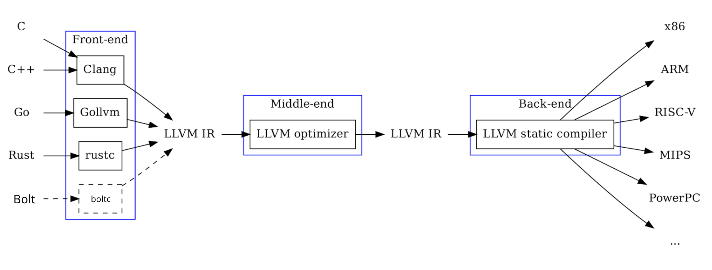
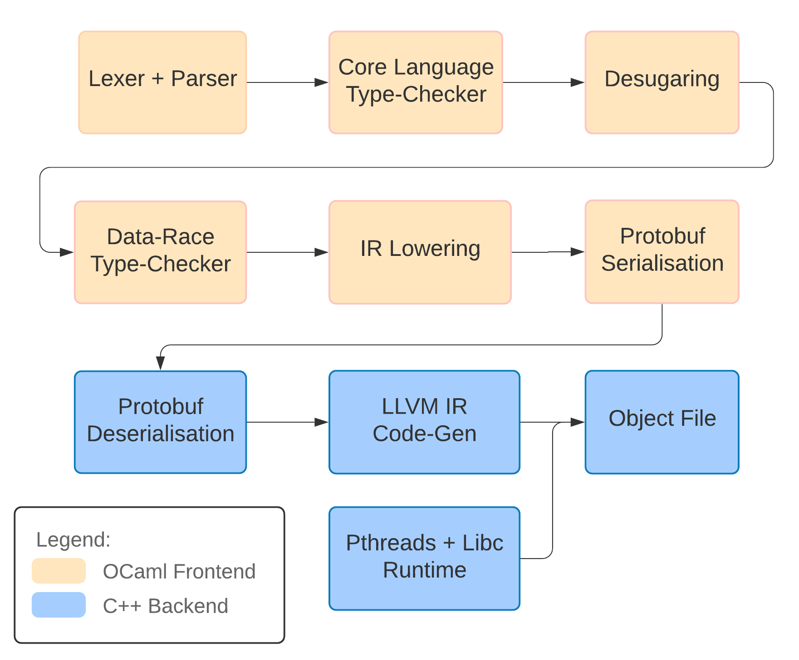

The diagram above is the compiler for the language Bolt we'll be building. What do all the stages mean? I have to learn OCaml and C++? Wait I haven't even heard of OCaml...

**Don't worry.** When I started this project 6 months ago, I had never built a compiler, nor had I used OCaml or C++ in any serious project. I'll explain everything in due course. The question we should really be asking is _why design your own language_? Possible answers:

1. It's fun
2. It's cool to have your own programming language
3. It's a good side-project

## Mental Models

Whilst all three of these (or none!) might be true, there's a bigger motivation: having the right **mental models**. See, when you learn your first programming language, you view programming through the lens of that language. Fast forward to your second language, and it seems hard, you have to relearn syntax and this new language does things differently. Using more programming languages, you realise that the languages share common themes. Java and Python have objects, Python and JavaScript don't require you to write types, the list goes on. Diving further into programming language theory, you read about the language constructs present - Java and Python are _object-oriented_ programming languages and Python and JavaScript are _dynamically-typed_.

The programming languages you've been using actually build upon the ideas present in older languages that you may not have have heard of. Simula and Smalltalk introduced the concept of object-oriented programming languages. Lisp introduced the concept of dynamic typing. And there are newer research languages coming all the time that introduce new concepts. A more mainstream example: Rust builds **memory-safety** into a low-level systems programming language.

Building your own language (especially if you're adding new ideas) helps you think more **critically** about language design, so when you go learn a new language it's much easier. For example, I had never programmed in Hack before my internship at Facebook last summer, but knowing these programming language concepts made it much easier to pick up.

## What are compilers?

So you've designed your fancy new language and it is going to revolutionise the world, but there's one problem. **How do you run it?** That's the role of a compiler. To explain how compilers work, let's first flash our minds back to the 19th Century, in the age of the telegraph. Here we have this fancy new telegraph but how do we send messages? **Same problem, different domain.** The telegraph operator needs to take in speech and convert it to Morse code, and tap out the code. The first thing the operator does is make sense of the speech - they split it into words (**lexing**) , and then understand how those words are used in a sentence (**parsing**) - are they part of a noun phrase, a subordinate clause etc. They check if it makes sense by classifying words into categories or **types** (adjective, noun, verb) and check the sentence makes grammatical sense (we can't use "runs" to describe a noun as it is a verb not a noun). Finally, they translate (**compile**) each word into dots and dashs (Morse code), which is then transmitted along the wire.

This seems like it labours the point, because so much of this is _automatic_ for humans. Compilers work the same way, except we have to explicitly program computers to do this. The example above describes a simple compiler consisting of 4 stages: lex, parse, type-check and then translate into machine instructions. The operator also needs some additional tools to actually tap out the Morse code; for programming languages, this is the **runtime environment**.

In practice, the operator likely constructs some shorthand notation that they know how to translate to Morse code. Now rather than converting speech into Morse code directly, they convert the speech into their shorthand, and then convert the shorthand into Morse code. In many practical languages, you can't just go directly from the source code to the machine code, you have _desugaring_ or _lowering_ stages, where you remove language constructs stage-by-stage (e.g. unrolling for loops) until we're left with a small set of instructions that can be executed. Desugaring makes later stages much easier, as they operate on a simpler representation. The compiler stages are grouped into frontend, middle-end and backend, where frontend does much of the parsing/type-checking, and middle-end and backend simplify and optimise the code.

### Compiler Design Choices

We can actually frame a lot of language and compiler design in terms of the analogy above:

Does the operator translates words on-the-fly into Morse code as they transmit them, or do they convert the words into Morse code beforehand, and then transmit the Morse code? **Interpreted** languages like Python do the former, whilst ahead-of-time **compiled** languages like C (and Bolt) do the latter. Java actually lies somewhere in between - it uses a **just-in-time** compiler which does most of the work beforehand, translating programs to bytecode and then at runtime compiles bytecode to machine code.

Now consider a scenario where a new Lorse code came out that was an alternative to Morse code. If the operators are taught how to convert the shorthand to Lorse code, the person speaking doesn't need to know how that's done, they get it for free. Likewise, a person speaking a different language just needs to tell the operator how to translate it to the shorthand, and then they get translations into Lorse _and_ Morse code! This is how **LLVM** works. **LLVM IR** (intermediate representation) acts as the stepping stone that lies between the program and the machine code. C, C++, Rust and a whole host of other languages (including Bolt) target LLVM IR, which then compiles code to a variety of machine architectures.

Static vs dynamic typing? In the first case, the operator either checks that the words make grammatical sense before they start tapping. Or, they don't and then midway through they're like "huh, this doesn't make sense" and stop. Dynamic typing can be seen as quicker to experiment in (like Python, JS) but when you send that message you don't know if the operator will stop midway through (crash).

I've explained it in terms of an imaginary telegraph operator, but any analogy works. Building up this intuition goes a long way in understanding which language features are right for your language: if you're going to be experimenting, then maybe dynamic typing is better as you can move faster. If you're using a larger codebase, it's harder to proof-read it all and you're more likely to make errors so you probably should shift towards static typing to avoid breaking things.

### Types

The most interesting part of the compiler (in my opinion) is the type-checker. In our analogy, the operator classified words as parts-of-speech (adjectives, nouns, verbs) then checked if they were used correctly. Types work the same way, we classify program values based on the behaviour we'd like them to have. E.g. `int` for numbers that can be multiplied together, `String` for streams of characters that can be concatenated together. The role of the type-checker is to prevent undesirable behaviour from happening - like concatenating `int`s or multiplying `String`s together - these operations make no sense so shouldn't be allowed. With type _checking_, the programmer annotates values with types, and the compiler checks if they're correct. With type _inference_, the compiler both infers and checks the types. We call the rules that check the types _typing judgements_, and a collection of these (along with the types themselves) forms a type system.

It turns out actually that there's a lot more you can do: type systems don't just check if `int`s or `String`s are used correctly. Richer type systems can prove stronger invariants about programs: that they will terminate, access memory safely, or that they do not contain data races. Rust's type system for example guarantees memory safety and data-race freedom, as well as checking traditional types `int`s and `String`s.

## Where does Bolt fit in?

Programming languages still haven't cracked the problem of writing safe concurrent code. Bolt, like Rust, prevents data races ([explained in this Rust doc](https://doc.rust-lang.org/nightly/nomicon/races.html)), but takes a more fine-grained approach to concurrency. Before keyboard warriors come at me on Twitter, I think Rust has done a brilliant job in getting the conversation about this going - whilst Bolt will likely never go mainstream, it's demonstrating another approach.

If we look back at the pipeline now, you can see that Bolt contains the lexing, parsing, and desugaring/lowering phases. It also contains a couple of Protobuf serialisation and deserialisation phases: these are purely to convert between OCaml and C++. It targets LLVM IR, and then we link in a couple of runtime libraries (pthreads and libc) and finally we output our _object file_, a binary containing the machine code.

Unlike most compilers though, Bolt has not one but **two** type-checking phases! Bolt has both traditional types and **capabilities**, which are, informally, another set of types to type-check data races. I've [written up a dissertation](https://github.com/mukul-rathi/bolt-dissertation) that explores this more formally, if you are interested in the theory, if not you can skip the data-race checking posts in this series. We type-check the traditional types first, simplify the language a bit in the desugaring stage, then do the data-race type-checking.

## And what about this series?

This series can be thought of from two perspectives: firstly, we will be discussing language design and comparing Bolt with Java, C++ and other languages along the way. Secondly, it is a practical step-by-step tutorial on building your own compiler. Unlike many build-your-own-compiler tutorials that tell you how to build a _toy_ language, some of the topics this tutorial looks at form the basis of concurrent object-oriented languages like Java: how classes are implemented, how inheritance works, generic classes, and even how concurrency is implemented under the hood.

Bolt also doesn't output toy instructions but instead targets **LLVM IR**. Practically speaking, this means Bolt hooks into the amazing optimisations present in C/C++ compilers. The LLVM API is powerful, but it's also very hard to navigate the documentation. I spent many long nights reverse-engineering C++ programs - hopefully this series prevents at least one person from going through that pain!

In the next part, we'll look at the practical aspects of setting up a compiler project - I'll walk through the [Bolt repository](https://github.com/mukul-rathi/bolt) and explain _why_ we're using OCaml of all languages for the frontend.
