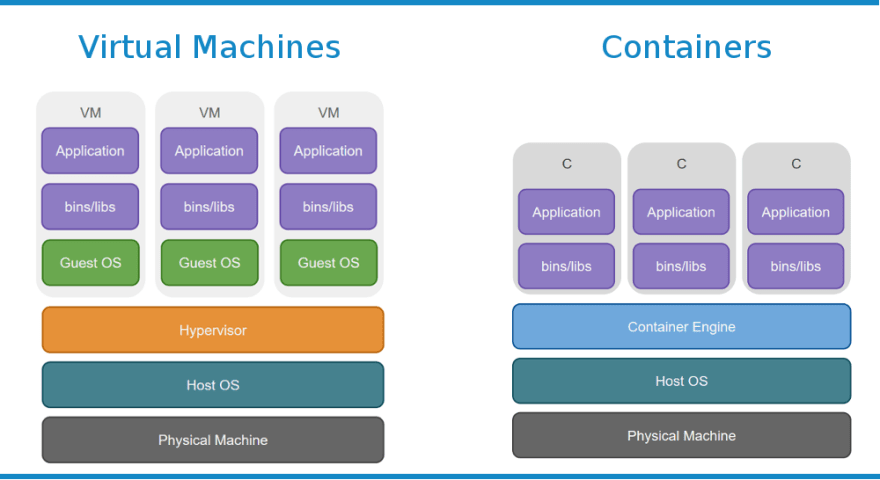

## Overview of the tutorial

In this tutorial we'll set up a database with a REST endpoint that other applications can send requests in order to perform operations on the database.  

This tutorial will illustrate the core aspects of three useful technologies:

* Docker
* Flask 
* PostgreSQL using Python (Psycopg2 library)


### JUST GIVE ME THE CODE!
This [example repository](https://github.com/mukul-rathi/CleanCycle/tree/tutorial) contains code for a database server storing air pollution sensor data. Check the __*tutorial*__ branch to see the code we are interested in (the master branch also contains the other sections of the project).

For sake of brevity the blog post will only highlight the important parts of the code, however I encourage you to fork the repository and build upon the tutorial repo when creating your own database and endpoint.

## Docker

Docker is all the rage when it comes to developing scalable applications, so a very useful technology to be familiar with. 

### What is Docker?

Consider trying to isolate different applications. One approach you might consider is to run each application in a separate **virtual machine** so each application has its own resources and is isolated from the others - we say they are **sandboxed**. The issue with this is that each VM requires a sizeable chunk of resources (multiple GBs of RAM, multiple CPU cores etc). An entire VM seems very wasteful, especially if the application itself doesn't require many resources. 

Rather than running separate OSs, Docker isolates each app at the *application layer* - each app is in its own **container** and they are managed by a Docker *daemon* running on the same host OS. 



This offers nearly as good isolation and *crucially* is **lightweight**. This lends itself to the **microservices** approach - rather than coding up the entire application on one monolithic machine, break down the code by task/service - and give each service its own container. 

In our case, we have two services - the **database** and the **REST endpoint**. The tutorial repo also contains a third container to run tests in.
 

Each container is self-contained - so we don't have any hidden dependencies and can run our services on any machine with Docker.

Docker thus makes it much easier to **scale** applications, since you can just deploy multiple instances of a container and load-balance on a **per-service basis**. So for example if you were receiving a lot of queries but the database was small and didn't change much, you might need multiple endpoint containers, but only one database container. 

_**Sidenote**_: If you are interested in deploying and orchestrating Docker containers then check out **Kubernetes**. 


### Setting up Docker

Firstly, you'll want to install Docker for [MacOS](https://docs.docker.com/docker-for-mac/install/), [Windows](https://docs.docker.com/docker-for-windows/install/) or [Linux](https://runnable.com/docker/install-docker-on-linux).

Start up the Docker daemon and in your terminal run `docker run hello-world` to check Docker has correctly been installed.


### Creating Docker Containers


There are two stages in creating containers - the first is to create an **image** (a specification) and then to build and run this image to get a **container** (a running instance of the image).

#### Docker Images


[DockerHub](https://hub.docker.com/) is a registry for prebuilt images that we can run as containers. To get an image from DockerHub, we can just run `docker pull <image_name>:<image_tag>`. Omitting the `:<image_tag>` will just pull the latest version instead.

In our case, we want the [Postgres](https://hub.docker.com/_/postgres) image. The DockerHub Postgres page contains a list of image tags, referring to less specific image versions as you go left-to-right and older images as you go top-to-bottom. For example, you might choose tag `11.2`, in which case you'd run `docker pull postgres:11.2`. 

The page also contains other useful information like the environment variables e.g. `POSTGRES_DB`, `POSTGRES_USER`, `POSTGRES_PASSWORD` we can use with the image.


If however there isn't a pre-built image you are looking for, you can take a **base image** from the DockerHub and write your own specification in a **Dockerfile** (important - note case and lack of file extension). When building the image, Docker will execute each one of the commands in the **Dockerfile** in turn. 

A typical **Dockerfile** contains a subset of the following commands. 

```docker
FROM <base image>  # here's a comment
WORKDIR <container_dir>
RUN <bash command>
COPY <host_path> <container_path>
CMD ["<executable>", "<param1>", "<param2>" ...] 
```
`WORKDIR` sets all subsequent container paths relative to that directory. 

`COPY` copies files (note only from current directory or subdirectories) from host to container.
 
`RUN` runs a bash command in the container (executed during the build process).  

`CMD` specifies the default executable to run when running the container (the executable isn't run in the build process) - note you can only have one `CMD` command in your DockerFile.

In our case, our endpoint is using Flask, so is built upon a [Python 3.6 image](https://hub.docker.com/_/python). The DockerHub page specifies that `WORKDIR` should be `/usr/src/app/` since that is where python will execute files.

```docker
#copy across and install python packages
COPY requirements.txt ./
RUN pip install --no-cache-dir -r requirements.txt

#copy across rest of files
COPY . .
# run bootstrap program upon running
CMD ["python", "./bootstrap.py"]
```


For a reference to full set of Dockerfile commands see [here](https://docs.docker.com/engine/reference/builder/).

To build our image, we can run `docker build` from the directory of the Dockerfile. One useful option is `-t <image tag>` which lets us refer to the image with a custom tag e.g. `hello-world`. 

Note that in this tutorial, whenever I refer to `<image>` subsequently, you can either use the image tag or the image ID e.g. `306e0c13101f`. 

### Running Images (Containers)

`docker run <image>` creates a **new** container from the built image and runs it. It takes in a variety of options:

* `-d` - detached mode -  container runs in background so can execute other terminal commands whilst it runs.
* `-p <host port>:<container port>` - map a host port to the container port, e.g. if we wanted to access a port inside the container.
* `-v <host volume>:<container volume>` - mount a host volume in container. Since `COPY` only copies the file at the time the image was built, mounting a volume prevents you from having to rebuild and restart the container every time you change the code. 
* `-t <container-tag>` - just like images, you can tag containers, and again, subsequent references to `<container>` can refer to tag or ID of container.
* `-e <ENV_VAR1>=<value1> <ENV_VAR2>=<value2> ...` - specify environment variables for processes inside the container.
* `--rm` - delete the container as soon as it has finished running.
* `--net <network>` - run container on specified network (see next section on docker networks).
*  `--help` - see the other options.

Once you have created the container, you can also run other docker commands to manipulate the container:
* `docker exec -it <container> <command>` - execute a command within a container.
* `docker start/stop <container>` - start/stop an *existing* docker container
* `docker kill <container>`  - forcibly exit a container.
* `docker ps` -get  a list of all *running* containers . `-a` option gets a list of *all* containers.
`docker logs <container>` - see the logs of a container - useful for debugging.
* `docker rm <container>` - delete a container
* ` docker rm $(docker ps -a -q -f status=exited)` - a useful command that deletes all stopped containers

Additionally, `docker system prune` is a good way of deleting any dangling images, containers, networks etc. and the `-a` option deletes the cache as well. 

### Docker Networks

By default there are three docker networks - **bridge**, **host** and **none**, which you can see by running `docker network ls` to get a list of the networks. By default, all docker containers run on the **bridge** network. 

You can create your own network by running `docker network create <network>`. To inspect a given network, we can run `docker network inspect <network>`.

As well as isolating subsets of containers in their own network, user-defined networks also have the nice property of *automatic service discovery* - a container can query another container within the same network using the `<container_name>` as the address (Docker will perform the DNS translation for the container's IP address).
 
You can also query the localhost of the host machine from within a container by using `host.docker.internal` as the host address - Docker will do the DNS translation on Windows and MacOS. For Linux, you can only get this by manually adding a `host.docker.internal` DNS record in the /etc/hosts file (**important gotcha**).  

### Docker Compose

As you can imagine, running `docker run` for each of your containers and passing in the command line arguments can become tedious. 

This is where **Docker Compose** comes in - rather than considering individual services (containers) we're now thinking at the level of the docker container networks. 

We specify the command line options configuration for all of the docker containers in a given network in a YAML file, by default a `docker-compose.yml` file in the current directory.

You can name your YAML file anything and pass it in using the `-f` option - so we have  `docker-compose -f <file> <command>` e.g. there is a `docker-tests.yml ` file to run tests in the tutorial repo.

**NB:** It is important to specify the version of Docker Compose being used since Docker often changes features between versions that are not necessarily backwards-compatible - thus this could break your project.

```yaml
version: '3' #docker-compose version
services: #the containers in the network
  endpoint: #container name
    build: ./src #specify directory of Dockerfile
    env_file: ./database.env #environment variable file
    volumes: #mount volumes (host:container)
      - ./src:/usr/src/app
    ports: #map ports (host:container)
        - 5000:80
    depends_on: # other containers it needs in order to run
       -  database
  database:
    image: postgres #if using an existing image 
    restart: always #what to do if container crashes
    env_file: ./database.env
    environment:
      - POSTGRES_USER=____ # specify individual env variables.
```

We can build all the containers using `docker-compose build` in the directory of the `docker-compose.yml` file. 

We can then run `docker-compose up` in the directory to run all the containers at once (we also have the `-d` detached mode option). To only run a particular container, we run `docker-compose run <container>` and this will exit once the given container finishes executing. (**NB**: this will also run any containers it is dependent on).

We can `docker-compose down` to stop the network and containers. The `-v` option also destroys any mounted data volumes.


**Helpful Tip:** - if you want to see a list of commands just run `docker` or `docker network` `docker container` etc. 

This [repo](https://github.com/veggiemonk/awesome-docker) is a one-stop shop for more Docker tutorials!

## Flask

Flask is a micro web-framework that makes it *super easy* to create our REST API. Flask's usage extends to serving up webpages based on templates, however this is not in the scope of this tutorial.

Flask is actually very quick and easy to get set up - one of its major selling points is that there is *little to no boilerplate code*.

At its simplest, Flask routes each endpoint e.g. `/analytics` (note relative to host url `/`) and its corresponding REST methods with a function that gets executed when a request is made to the endpoint. We tag the said function with `@app.route('<endpoint>', methods=<list of REST methods>)`. 

We can then run the Flask endpoint by running the app on the given host and port. 

Note `app.run()` runs the code on a copy of the code at that instance you run it (i.e. subsequent changes to the code won't affect the endpoint).

We can pass the `debug=True` argument to `app.run()` so that it reloads the Flask endpoint on code change and provide helpful logs in the debugger (e.g. if there was a TypeError).

```python 
from flask import Flask 

app = Flask(__name__)

@app.route('/data', methods=['GET', 'POST'])
def getData(): # execute function when this endpoint queried.
  return "Some Data"

app.run(host=<host>, port=<port>).
```

### Dynamic URLs 

By default these functions have no arguments, however we can specify dynamic URL endpoints by including the argument `<arg>` (note here the `<>` *is* included) in the endpoint URL e.g. `/something/<arg1>/<arg2>` and then passing the corresponding arguments to the function - i.e. `def some_function(arg1, arg2):`.


### Request/Response Objects 

Flask has implicit `request` and `response` objects that we can manipulate for REST requests/responses.

To parse a REST request, we can call `request.<method/field>` - a list of example `<method/field>`s is:
* `args` - dictionary of args.
* `method` - type of request 'GET', 'POST' etc.
* `files` - dictionary mapping file-names to Python file objects
* `form` - get form data in request
* `get_json()` parses the data as JSON and returns a dictionary.

 and so on. 

The return value of the function is automatically wrapped in a response object with status code `200 OK` and `text/html` mimetype.
We can get more control over the headers and status code by instead returning a tuple - `(response, headers)` or `(response, status, headers)`.

### Error Handling 

We can run `abort(<status code>)` in our functions to "throw" errors, and handle these with a handler function tagged with the corresponding `@app.errorhandler(<status code>)`. 


### Flask example

To give a concrete example tying all these Flask concepts (the actual code for the database server is in the repo).

```python
from flask import Flask, request
app = Flask(__name__)  

@app.route('/data', methods=['GET', 'POST'])
def getData(): # execute function when this endpoint queried.
    # can extract fields from request object 
    if request.method == 'POST':
        data = request.get_json()
    if data.isSimple: # query dict fields
        return "Something" 
    else: 
        return "Server error", 500, {
            'ContentType': 'text/plain'
            }
            s
@app.errorhandler(500)
def server_error(error):
    return "There is an internal server error"

@app.route('/users/<username>', methods=['GET'])
def show_user_profile(username):
    return f'User: {username}' 

if __name__ = '__main__':
    app.run(debug=True, host='0.0.0.0', port=80)
```

For our database server example, Flask will just route the endpoint to the function, extract any fields from the request and wrap the function return value. The details are in the `src/endpoint.py` file.

The actual meat of the function call requires interacting with our database, which leads us onto our final section: 

## PostgreSQL 

For sake of brevity, this tutorial assumes you have a grasp of SQL syntax, and will instead focus on how we execute PostgreSQL commands in Python. If you want a more in-depth tutorial, [this site](http://www.postgresqltutorial.com/) is a comprehensive PostgreSQL resource.

A quick refresher on the key database concepts:

PostgreSQL is a database management system dealing with **relational databases**. Relational databases store their data in stored as *records* in tables. Each record = a row in the table e.g for the table with columns `name, university, year`, an example record would be `(Mukul, Cambridge, 2)`. Each table has a defined **schema** - the format we want data to take, this consists of the column names and types, and other properties like primary keys and foreign key constraints.

### Establishing a connection

To establish a connection with and perform operations on our PostgreSQL database in Python, we will be using the `psycopg2` library in conjunction with the more general `sqlalchemy` library. These database adaptor libraries allow us to map Python values to SQL equivalents (e.g in Python  `None, True, False` correspond to the 3 SQL literals `NULL, true, false`).

To execute our SQL query, we first set up a connection, passing in the relevant arguments: 

A connection object encapsulates a database session - we can isolate these by using transactions for our ACID guarantees - e.g. using `conn.commit()` or `conn.rollback()` to commit/rollback a transaction.

```python
engine_params = f"postgresql+psycopg2://{db_user}:{db_password}@{host}:{port}/{db_name}"

engine = create_engine(engine_params)
conn = engine.raw_connection() 
cur = conn.cursor()
```

### Executing SQL queries.

Each connection object has cursor objects, which are used for executing PostgreSQL commands e.g. ` cur.execute("<SQL QUERY>")` - i.e we write our SQL query as a string. 

If the query returns any records, we can get them by calling `cur.fetchall()` - returning a list of records (which are themselves represented as a list).

If we want to insert values into our query, we can use `%s` in our string, and pass a *tuple* as second argument to `cur.execute()` - if we only have one value we pass `(val1, )` as second argument.

```python
cur.execute("INSERT INTO table1 (col1, col2, col3) VALUES (%s, %s, %s)",
    (val1, val2, val3))
```

### Dynamic Queries 

For dynamic SQL queries, it is important to **avoid string concatenation** as it leaves you prone to SQL injection. Instead `psycopg2` requires that we use the *psycopg2.sql* module. 

The SQL module allows you to generate SQL statements dynamically by composing together `Composable` objects rather than raw strings so you don't need to worry about escaping characters.

Some example Composable objects:
* `sql.SQL(<string>).format(<obj1>, <obj2>,...)` - just like a regular string `.format()`, the `.format()` method substitutes in a Composable object for each `{}` in the `<string>`. 
* `sql.SQL.(',').join(<list of composable objects>)` - again similar to `.join()` method of a string.
* `sql.SQL.identifier(<identifier>)` - this is used when referring to PostgreSQL objects, e.g. tables by name.

For example, if we wanted to iterate through the dictionary of table names and schemas to create tables in our bootstrap script, we would dynamically generate an SQL query.

```python 
from psycopg2 import sql
# a dictionary of tables and schemas.
schemas = {
        "table1":
        "(col1 type1 PRIMARY KEY, col2 type2)",
        "table2":
        "(col1 type1, col2 type2 PRIMARY KEY, col3 type3)",
,
} #dictionary for us to store our schemas
for table, schema in schemas.items():
  cur.execute(
      sql.SQL("CREATE TABLE IF NOT EXISTS {} {}").format(
      sql.Identifier(table), sql.SQL(schema))
      )


```

For the example database server, we encapsulate all the `psycopg2` operations in a `DBConnection` class, and the table schemas in a `Database` class - both of which are stored in the `src/db_connection.py` file. 


## Summary

To summarise, in this tutorial, we took a top-down approach to the technologies involved in designing the database server.

First we looked at the level of the individual micro-services (endpoint and database) and how we could run each service in its own Docker container on the same network (specified by the Docker Compose file).

Having done this, we looked at the endpoint and how we would implement the REST API using Flask, and then finally fleshing out the database operations using PostgreSQL and Psycopg2. 

As mentioned earlier, I encourage you to fork the [example repository](https://github.com/mukul-rathi/CleanCycle/tree/tutorial) and build upon the __*tutorial*__ branch.

