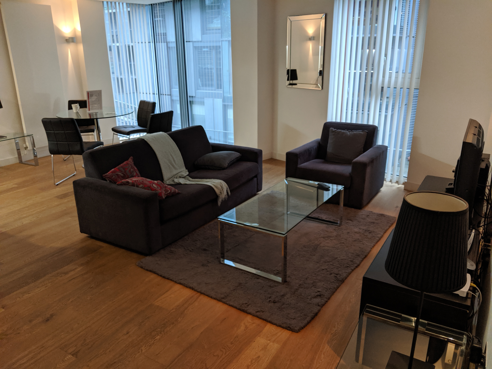
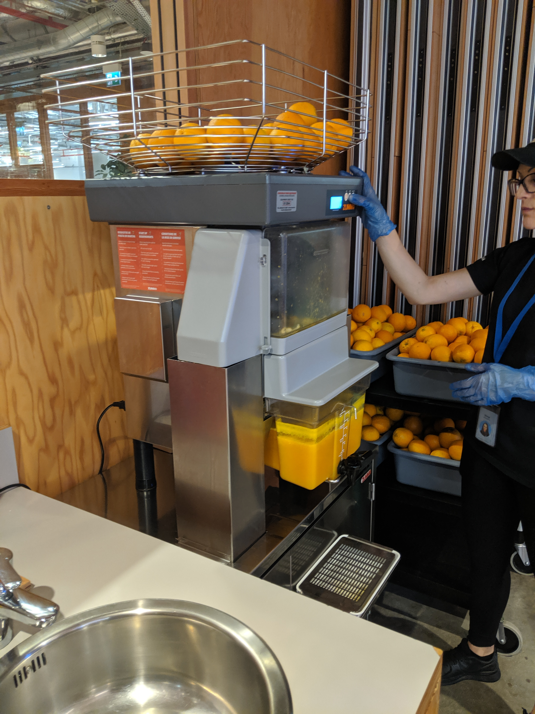
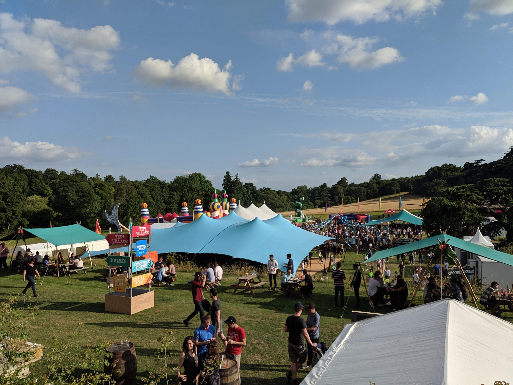

**Disclaimer: All opinions and observations are my own and I do not speak for Facebook.**

It's coming round to internship interviewing season again, so for those considering interning at Facebook, here's a post that will hopefully give you a better insight of what it is like to intern at Facebook! I thoroughly enjoyed my internship this summer and would strongly recommend interning here - in fact I'll be returning next summer for another internship!

I'll touch on as many of the major things that go on in a typical 12 week summer internship as I can, but if you have any questions, feel free to ask in the comments below.

## Application Process

This is a FAQ, so I'll detail my personal experience for completeness - if you want to find out more about the internship application there's a whole bunch of excellent resources online and tips and tricks, so I won't go through that in this post.

Facebook came to my university to give a talk about the interview process, following which I [applied online](https://www.facebook.com/careers/students-and-grads/). I had two video interviews consisting of the standard algorithm and data structures problems before receiving my offer, and the entire process was really quick.

After the offer, Facebook also sent a small welcome gift, which was a lovely touch!

### Project Selection

A few months before the internship, Facebook reach out to you with a survey of your interests and strengths, so they can match you to a project. The team that matches you to a project does a great job, even if it might end up being completely different to what you've put down as interests! I'd put down infra backend as an interest for my survey, as I wanted to try something completely new, but the project they'd chosen for me aligned more with my previous experience (more on that later!) and I actually ended up _really_ pleased with the project.

## Scale

The first thing you notice when entering the Facebook office is just how big everything is. I interned at the main London office this summer, whichhouses 1,500 employees. To put it into perspective, there were more interns in my batch joining the London office than there were employees at the startup I'd interned at the previous summer!

In our orientation, we were told about how Facebook's scale introduces new engineering problems - "take something that is easy for a million users, when you scale it to a billion it suddenly gets way harder". The scale is genuinely mind-boggling - initially I would often do a double-take when my manager briefed my on the sheer scale my project was operating on.

This scale leads to custom internal tooling and technologies for almost everything. Sometimes, Facebook open-sources these technologies, a prime example being React.

Having so many interns has its pros - for one, it means that the internship program is really well-organised, and also having that community of fellow interns ramping up with you makes the first few days a lot less intimidating. Interns at the London office come from all over the world - Brazil, Jordan, Canada, Australia, you name it!

Meeting so many different people from diverse backgrounds really augments the internship experience. Iindeed, the social events and friends made added another dimension to my time here at Facebook.

## Culture

### Quirks

One of the best things about the culture at Facebook is how relaxed and quirky it is. Internally on Workplace (think Facebook for businesses) as well as having groups for work / communicating between different teams, there is also a social side with a group for pretty much anything! This ranges from internal versions of popular memes / internet trends to random groups like "Things Lift Manufacturers Would Disapprove Of" which consisted of photos of the funniest bugs the lifts in the office had.

The office also has quirks like themed meeting room names for different sections of the office from Harry Potter and Games of Thrones references ("Dobby is a Free Elf") , to cricket field positions, to things British people disapprove of ("Standing on the Left", "Needless Pleasantries" being a couple of my favourites).

### Being Open

The culture is also very _open_ with company-wide live-streamed weekly Q&As with Mark Zuckerberg, as well as a series of intern-only Q&As with Mark, Sheryl and other top Facebook executives. Mark's intern Q&A was actually a lot of fun; he seemed really relaxed with the interns, and so answered all manners of questions from whether he approved of memes (he does!) to discussions on the challenges he's encountered as Facebook has grown.

### Hackathons

I'm a big fan of hackathons, and they're an integral part of Facebook's culture; things like the Timeline and the Like Button were hackathon ideas!

Facebook organised a hackathon on only my 3rd day. It was quite the blur - learning Hack on the go and trying to navigate the codebase to add our hackathon feature to News Feed - and really rewarding to actually modify Facebook on our sandbox! Hackathons are really good fun and I would advise future interns to participate and to stick around to the end to demo your project and see the other demos.

Looking back, I would have loved if the hackathon was later in the internship, as I think with actual codebase experience the prototype we designed (which I can't disclose due to obvious NDA) could have been even better!

## Project

With such a large codebase and a variety of new technologies, I spent the first couple of days trying to wrap my head around my project and how it fit in with the existing infrastructure. I was on the Catalog Experience team (Catalog being the product graph where businesses can upload their inventory to Facebook for ads), specifically working with pixel-based catalogs.

To give you an idea of what a project looks like, I'll quickly detail the different aspects of my project.

Since I was working on the **Experience** sub-team of Catalog, it meant my project was business-facing, meaning I was working on both front-end (React and Flux) and backend (Hack). Now I know PHP gets a bad rep as a programming language, but I enjoyed working in Hack, so I would say to prospective interns: don't be put off by Hack since it's very similar to most other programming languages.

At Facebook, unlike a startup, there are more specialised non-engineering roles, such as Content Strategists (who work on the text content displayed to users) along with designers and UX researchers, however when it comes to cross-functional projects engineers drive the projects. In my project, this meant I was organising weekly sync-up meetings with the designer and content strategist on my team to discuss the UI design, which I ended up really enjoying. It's got me really interested in learning design, and I might blog about that in the future.

My project also involved some data analysis when designing the new infrastructure - running SQL queries to predict current load on the infrastructure and expected growth, as well as analysis of production logs when it came to actually shipping the code.

I was extremely fortunate to have such a well-thought-out project, and although Facebook is such a huge company, it felt like my project was genuinely impactful, rather than a small cog in a big machine, which was one of my worries when joining. Facebook's project matching team really did an excellent job!

### Tips for future interns

- **Task-oriented learning** - with so many technologies and aspects to the project and a huge, it's easy to get overwhelmed. I've found that you don’t need to learn the language or tech completely, just learn from examples (try to understand what the code is doing) and then learn by actually implementing. And if you're stuck then...
- **Ask for help more** - I found that my team were super friendly and extremely willing to help. If you go out and proactively unblock yourself by asking questions, it means you can get so much more done. Don't feel like a burden, one of the pieces of feedback I got was that I should actually ask for help more - there were points in my project where my manager actually expected me to reach out for help.
- **Don't take existing code for granted** - just because it got through code review in the past, doesn't mean that it's good code. Codebases evolve over time and better approaches become available, e.g. if new class abstractions or util functions have been written since.

### Evaluation

At the start of your internship you are assigned **peers** on your team whose job it is to support you along with your **manager**, and then provide feedback when it comes to evaluation. Typically you tend to get feedback from the code reviews and also in the weekly 1:1 meeting with your manager.

Although the internship is 12 weeks long, the evaluation period for a return offer is only the first 10 weeks (since it takes time for the evaluation process when deciding on final offer). You have two reviews, one at your midpoint (week 5) for feedback to correct course if necessary, and then the offer decision which is due by the end of week 10.

Luckily I was trending towards an offer at the midpoint and I got a return offer, so on both occasions there was only one way to celebrate - ice cream on the top floor of the office!

On that note, let's talk perks - the glamorous part of working at a large tech company like Facebook ;).

## Perks

### Corporate Housing

Facebook provides interns with the option of free accommodation in Central London. This is super convenient - it meant that the office was only a 25-min walk from my apartment, and you're staying next door to other interns.

### The Office

The entirety of Facebook London's office is geared towards providing a great environment for you to work with no worries.

Stressed / overwhelmed by the task and need a break? Head to the music room, games rooms or even an arts and crafts lab.

Exhausted and need a quick nap? There are nap pods on the third floor.

Need accessories (like a keyboard) for work? Get one from the vending machine on your floor. Yes, you read that right. A vending machine. That dispenses tech accessories. Pinch me.

Food? Oh you definitely don't have to worry... Freshly squeezed orange juice for breakfast? Check.

Facebook provides employees with a lot of free food and is one of my favourite perks. Breakfast, lunch and dinner is served in the office, and in addition to the 3 meals served, you also have snacks and coffee/tea in the micro-kitchens, and the London Rathbone office also has a Donut bar that stocks donuts, a variety of flavours of ice cream, sandwiches, smoothies, and even a wall of pure sugar (fizzy colas, jelly beans etc) ...

I could go on - there's so much variety that you often overeat at the start of the internship! This has been coined the _Facebook 15_, where employees gain 15 pounds within a year of joining Facebook.

### Social events

At Facebook's scale, even in the London office you barely know most of the people in the canteen, with even more new people are being hired all the time. The net result is that you end up mostly hanging out with your team and any friends you made in bootcamp / other interns. This isn't great for cross-team collaboration, so Facebook incentivises us to socialise by reimbursing costs towards social events (“BFF”s) and Free Lunch Wednesdays (where you go to a nearby restaurant).

BFFs include restaurants, cinema, karting, even a pizza making class! Here's the thing: it genuinely works a treat! The diversity of the people I met through attending these events really enriched my internship experience and I would highly recommend it. Despite what you may think, software engineers have a lot more than software to talk about in their free time!

Facebook also runs a massive summer party for each office, with stalls for food and activities - like archery tag and a HUGE bouncy castle.

A caveat with these perks is that time is usually the most precious resource - at the end of the day I'd rather go home than play video games in the office. And you _still_ have to work - I found that as the internship progressed and the amount of work to do increased, I spent less time using these, with the exception of the music room, which I used to destress.

### Intern events

Facebook also arrange intern-only social events throughout the internship. These range from West End musicals (Aladdin and the Lion King were amazing) to escape rooms to even a boat party on the Thames.

## Wrap up

Throughout the course of a 12-week internship, you get to know your team really well, and just as you've settled in, it's time to wrap up. The last few days of the internship were very hectic as the internship came to a close and loose ends were being tied. Offer decisions and feedback meetings. Finishing shipping the stretch goals and monitoring rollout. Fixing a last couple of bugs and filing tasks to be completed once you leave.

You hand in your tech and it sinks in, you are no longer an employee. One final dinner, a board game and then the goodbyes. It's the end of the internship.

I'll be returning to intern again at Facebook London next summer, so if you do decide to join the London office, please drop me a message on Workplace then!
