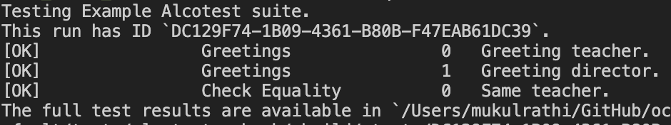
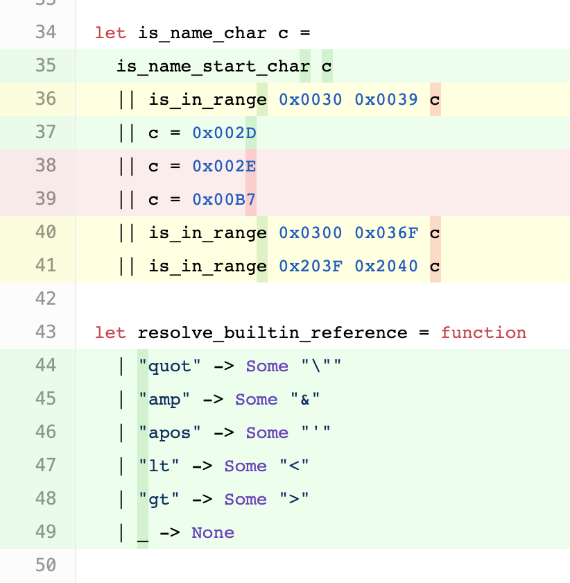
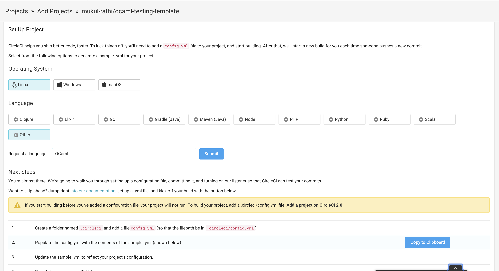

Whilst OCaml's amazing type system might prevent a lot of common programmer errors, it certainly doesn't mean you should not test your code! In this post, we'll cover 3 different testing libraries - **Alcotest**, **QCheck** and **PPX Expect**, each with different styles of testing: **unit tests**, **property-based tests** and **expect-tests** respectively.

We then look at how you'd integrate them and compute test coverage in a CI workflow.

## JUST GIVE ME THE CODE!

The [template repo](https://github.com/mukul-rathi/ocaml-testing-template) contains the examples mentioned in the blog post. Fork it to get up and running with Dune!

## Alcotest

[Alcotest](https://github.com/mirage/alcotest) is a lightweight OCaml unit testing framework. To install it, run `opam install alcotest`.

To understand Alcotest, we're going to work bottom-up through the testing library.

### Testable

First, let's talk about how Alcotest compares your expected value with the actual value.

To compare two values of a given type `'a`, we need to construct a new type `'a testable`. We need two functions - a function to check equality of two values of type `'a`, and a pprint function for `'a` (used by Alcotest in the error message when your test fails - "Expected foo but got bar").

Let's create a simple type to demonstrate this:

```ocaml
type foo = Foo of string | Bar of int

(* pprint_foo : Format.formatter -> foo -> unit *)
let pprint_foo ppf =  function
| Foo str -> Fmt.pf ppf "Foo: %s" str
| Bar i -> Fmt.pf ppf "Bar: %d" i

let foo_eq a b = (a=b)

(* Pass these two functions in to get a value of type foo testable *)
let foo_testable = Alcotestable pprint_foo foo_eq
```

### Test Cases

Now that we have got a type that Alcotest can use to check equality, let's construct a function that tests another function using `Alcotest.check`:

```ocaml
(* function to test *)
let gen_foo () = Foo "Hello World"

(* Alcotest test functions are of type unit -> unit *)
let test_gen_foo () =
Alcotest.(check foo_testable) "same foo" (Foo "Hello World")
    (gen_foo())
```

Running through this, the first argument to `check` is a value of the testable type. For the OCaml built-in types, Alcotest already has a testable type of the same name e.g. you'd write `Alcotest.(check int)`.

The second argument is a string describing what we are asserting.

The third argument is the expected value (of type `foo`) and the final argument is the actual value when executing the function.

Great, so now we have a function that tests another function, let's construct the Alcotest test case.

An Alcotest test case is of the form:

```ocaml
Alcotest.test_case "Test case name" `Quick test_something
```

The `` `Quick `` refers to the speed level of the test case: `` `Quick `` tests are run all the time, whereas `` `Slow `` tests can be optionally disabled (e.g. stress tests that you only run on major releases).

### Running test suites

We've discussed how to create individual test cases, so let's tie this together by running a test suite.

An Alcotest

Alcotest groups test cases together to form a **test**, and then groups these tests to form a **test suite**.

This looks something like this:

```ocaml

let () =  Alcotest.run "Example test suite name"
[
  ("Name of test", [ list of test cases ]);
  ("Name of another test",  [ another list of test cases ])
]

```

A concrete example (this is in the [template repo](https://github.com/mukul-rathi/ocaml-testing-template)):

```ocaml
let () =
  Alcotest.run "Example Alcotest suite"
    [
      ( "Greetings",
        [
          Alcotest.test_case "Greeting teacher" `Quick
            test_greeting_teacher;
          Alcotest.test_case "Greeting director" `Quick
            test_greeting_director;
        ] );
      ( "Check Equality",
        [ Alcotest.test_case "Same teacher" `Quick
          test_teachers_are_equal ] );
    ]
```

produces the following output when run:



## QCheck

So with Alcotest, we've shown how to write unit tests for particular test inputs. But what if we want to show an **invariant** of the function holds for all inputs? E.g. test that the function `let id x = x` is returns its input for all inputs.

This is known as a _property-based test_, and is where the testing library [QCheck](https://github.com/c-cube/qcheck) comes in. Rather than testing on a particular input, you get QCheck to generate random input values of that type and check the **invariant** holds true for all those inputs.

To install QCheck, run `opam install qcheck`.

Here's how we'd test our identity function example in QCheck:

```ocaml
let test_identity_function =
  QCheck.Test.make ~count:1000 ~name:"test identity"
    QCheck.(int)
    (fun i -> (id i) = i)

```

Let's run through the arguments:

First the named arguments: `~count` is the number of random values we want to test on, and `name` is the name of the test case.

The next argument we pass is the generator of random values `'a` - this has type `'a arbitrary`. Here, we're generating values of type `int`, and just like Alcotest, since `int` is a built-in OCaml type, there's a provided generator: (`QCheck.(int)`) (it has type `int arbitrary`).

This [excellent blog post](https://blag.cedeela.fr/quickcheck-for-ocaml/) by the creator of the library explains how you define your own `'a arbitrary` type for your custom types `'a`. The [README](https://github.com/c-cube/qcheck/blob/master/README.adoc) of the library also provides more up-to-date examples.

Finally we provide a function that takes a randomly generated value `a` and returns whether or not the property holds (i.e its type signature is `'a -> bool`). Here, we're generating `int` inputs, so the function is of type `int -> bool` and checks whether the return value of `id i` is the int `i` itself.

QCheck integrates with other testing libraries really nicely. For Alcotest, run `opam install qcheck-alcotest`. Then we can convert a QCheck test case to an Alcotest test case using the `QCheck_alcotest.to_alcotest` function.

```ocaml
let alcotest_test_case  = QCheck_alcotest.to_alcotest qcheck_test_case
```

## PPX Expect

[PPX Expect-Test](https://github.com/janestreet/ppx_expect) is a testing library provided by Jane Street that takes a different approach to testing. We can install it by running `opam install ppx_jane`.

Traditional unit tests follow the format:

- **Arrange** (set up the inputs)
- **Act** (do the thing being tested)
- **Assert** (compare the result with a value)

Especially for custom types, there can be a lot of programmer overhead involved in the set-up and comparison steps.

Expect-tests provide an alternative: **insert print statements** in your code, and compare against the expected printed output.

> Expect-Tests capture what we as programmers do when debugging - print statements - and use it as a regression test.

Check out [this post](https://blog.janestreet.com/testing-with-expectations/) on the Jane Street blog explaining expect-tests.

In terms of test code, it's really quite brief:

```ocaml
let gen_hello_world () =
  let output_str =  "Hello World" in
  print_string output_str; (* insert print statement *)
  output_str

(* Test in same file as source code *)
let%expect_test "Test name" =
(* run src code - here I'm ignoring the output *)
  ignore (gen_hello_world ());
  [%expect {|Hello World|}]

```

To run the test, since Jane Street (who open-sourced this library) run these tests inline with the source code, we need to add the `(inline_tests)` stanza to our `dune` file. We also need to preprocess the `let%expect_test` ppx extension with `ppx jane`.

So your dune file will look like:

```
(library
 (name test_parsing)
 (inline_tests)
 (preprocess
  (pps ppx_jane))
  )
```

Note a workaround if you, like myself, are not a fan of inline tests is to create a tests library that has the source code library as a dependency. The [template repo](https://github.com/mukul-rathi/ocaml-testing-template) has both styles of expect tests, so take your pick!

### Autogenerated Test Output!

Oh, and if you were wondering how you'd generate the tests' expected print outputs, **this is done for you**! The library generates `.ml.corrected` files in the `_build/` directory when you run the test. Running `dune promote` after the test updates the source file with the corrected output.

Or in one simple command - `dune runtest --auto-promote`!

<TwitterTweetEmbed tweetId="1204866996158050307" />

## Test Coverage

Test coverage is a great metric to incorporate into your project, as whilst 100% test coverage != bug-free code, increasing test coverage can help you cover edge cases.

For test coverage, we'll use the [Bisect PPX](https://github.com/aantron/bisect_ppx) library.

We then add bisect_ppx to our source code's `dune` files, by adding `bisect-ppx --conditional` to the preprocess stanza.

We have the `--conditional` flag because we only want to annotate coverage information when we generate a test coverage report, not for the software that gets released.

For example, if we want to calculate test coverage for the modules in library Foo, the dune file would look like:

```
(library
(name foo)
(preprocess (pps bisect_ppx --conditional)
)
```

To generate the coverage report:

- We first run `BISECT_ENABLE=yes dune build` (set the conditional flag true when building).

- We then run our tests on the source code (using `dune runtest` or whichever other test script you have).
- Finally, we generate our report, using `bisect-ppx-report summary` for a textual summary, or `bisect-ppx-report html` to generate the html files in the `_coverage/` folder of your project.



Finally, moving onto the topic of CI, we can use **Coveralls.io** to display the test coverage for each commit to the repo - in the CI we'd run `bisect-ppx-report send-to Coveralls`.

## Continuous Integration

For continuous integration, this [CI skeleton scripts repo](https://github.com/ocaml/ocaml-ci-scripts) contains set-up for Travis CI. However, in practice I found Circle CI is _much_ faster, so I would recommend you use it instead.

To set up Circle CI, we head to Circle CI and authenticate with GitHub. You'll be greeted with a screen similar to this:



So instead, we'll use a Docker setup, using a base OCaml debian image. We use CircleCI's cache to cache the opam dependencies for our project, using the `opam` file's checksum to determine when to flush the cache and do a fresh install. In the CI, we run the tests, and calculate and send the test coverage report to Coveralls.

This looks something like this:

```yaml
version: 2
jobs:
  test:
    docker:
      - image: ocaml/opam2:debian-10-ocaml-4.08
    environment:
      - TERM: dumb
    steps:
      - checkout
      - restore_cache:
          key: cache-{{ checksum "hello_world.opam" }}
      - run:
          name: "Install deps"
          command: sudo apt-get install -y m4  && opam install --yes . --deps-only
      - save_cache:
          key: cache-{{ checksum "hello_world.opam" }}
          paths:
            - ~/.opam
      - run:
          name: "Set up source code for test coverage"
          command: opam exec -- BISECT_ENABLE=yes dune build
      - run:
          name: "Run tests"
          command: opam exec -- dune runtest
      - run:
          name: "Send Coveralls.io coverage report"
          command: opam exec -- bisect-ppx-report send-to Coveralls
workflows:
  version: 2
  build:
    jobs:
      - "test"
```

I'm using `opam exec --` here so the CI can find `dune` - if you know of an alternative fix, please let me know!

Full details of the CircleCI config file are in the [template repo](https://github.com/mukul-rathi/ocaml-testing-template). To send to Coveralls.io, you'll need to add the environment variable `$COVERALLS_REPO_TOKEN` to your CircleCI project, the value of which you can get from the Coveralls website.

## Wrap Up

The [template repo](https://github.com/mukul-rathi/ocaml-testing-template) contains code examples for the testing libraries mentioned, so I'd recommend you just fork it to get up and running!

The template repo also lints the code and autogenerates HTML documentation (discussed in the previous post on Dune) and deploys it to GitHub Pages. More detail about this in the README.

Feel free to tweet at me if you have any questions about this blog post. Till next time!
