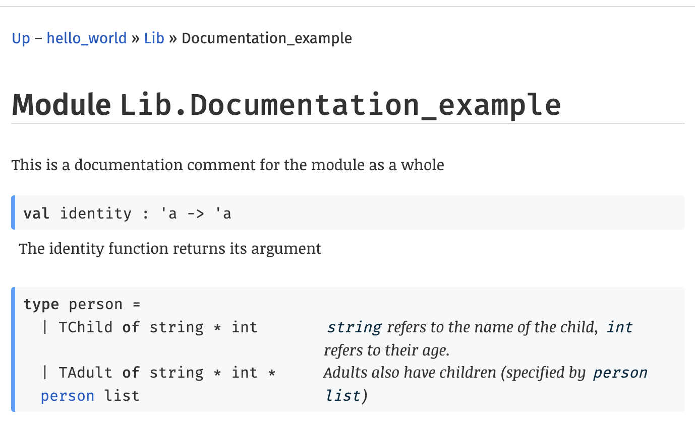
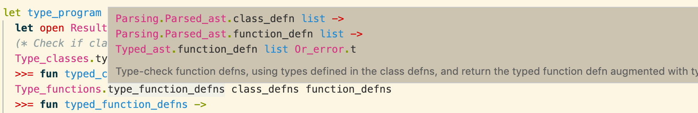

## Why have a build system?

When working on a larger OCaml project, you'll eventually end up working on programs spread across multiple files. In OCaml, each file `foo.ml` can be used as a module `Foo` in other files, with its interface exposed in a `foo.mli` file. [More detail in Real World OCaml](https://dev.realworldocaml.org/files-modules-and-programs.html). But this introduces a dependency: you need to link the compiled `foo.ml` file with any files that use the module `Foo`.
Trying to keep track of these dependencies when compiling these files manually becomes a pain as your project scales. Build systems like Dune take in build rules and automate this process for you.

I'm going to spend this post explaining the ins and out of Dune and also get into some of the really cool ways it interoperates with the rest of the OCaml ecosystem. In the template repo, I've also included a ReasonML example - Dune works great with both OCaml and ReasonML.

> For #OCaml and @reasonml, Dune is the ONLY build system you should be using!

## JUST GIVE ME THE CODE!

The [template repo](https://github.com/mukul-rathi/ocaml-testing-template) contains the examples mentioned in the blog post. Fork it to get up and running with Dune!

## Setting up your project

You can install dune using OCaml's package manager **opam**. Simply run `opam install dune`.
For your project, in the project's root directory, you'll also need a `opam` file. (For JavaScript programmers, an `opam` file is similar to a `package.json` file). [More info about opam files](https://opam.ocaml.org/doc/Packaging.html).

Dune is a **composable** build system. Each directory contains a `dune` file (note the lack of file extension) specifying how to build the files in that directory, and Dune composes them when building the project.

Alongside the `dune` files, projects contain a `dune-project` file in the root directory. In this file, you specify the name of the project, but also the version of Dune you're using (we're using version 2.0 here). This means that even if future versions of dune are not backwards-compatible, it won't affect our project.

Dune's build file syntax consists of **stanzas**, which are bracketed s-expressions e.g. `(lang dune 2.0)` and `(name hello_world)`.

So your `dune-project` file is:

```
(lang dune 2.0)
(name hello_world)

```

## Dune files

`dune` files are where we really specify all the build configuration options. Remember, at most **one** `dune` file per directory.

There are three different types of stanza we can write in a `dune` file:

### Executable

```
(executable
(name main)
<options>
)
```

This creates a binary that we can execute using `dune exec main.exe` (note file ending is `.exe` regardless of whether on Windows or not).

### Test

```
(test
(name foo)
<options>
)
```

or alternatively, if there are multiple tests in that directory:

```
(tests
(names foo bar baz)
<options>
)
```

I'll talk more about writing tests in a follow-up post where we'll look at OCaml testing frameworks. For this post on Dune, the key takeaway is that `dune runtest` will find and run all the tests specified by these `test` stanzas.

### Library

```
(library
(name lib)
<options>
)
```

This creates an OCaml library `lib`, which we can build using the command `dune build`. We can refer to module `Foo` in that library as `Lib.Foo`. You can think of `Lib`as a module that contains all the modules in the same directory as the `dune` file.

If however, we have a module with the same name as the library (here `Lib`), the library **only consists of this module** (it ignores the other modules in the directory), and we refer to this module as `Lib` not `Lib.Lib`.

### Configuring Build Options

Within stanzas, we can list additional options for our build. Here are a few useful commands in Q & A format:

#### How do I create a public library?

Add the `(public_name <name>)` stanza. Note however, that there must be a `opam` package file of the same name in the root of your project.
E.g. if we have

```
(library
(name foo)
(public_name foo)
)
```

then we must have a corresponding `foo.opam` file in the project's root directory. Note however, that if your library is public, then all libraries that are dependencies must **also be public**.

#### How do I use other OCaml libraries?

Add the `(libraries <names>)` stanza to your `dune` file.

E.g. an executable that wants to use the Core and Fmt libraries:

```
(executable
(name main)
(libraries core fmt)
)
```

#### How do I access modules in a different directory?

**Option 1:** Create a library stanza that includes those modules. Then use the `(libraries <names>)` approach detailed in the previous question.

**Option 2:**
If the modules are in a subdirectory, then you can use the `(include_subdirs unqualified)` stanza.

```
(executable
(name main)
(include_subdirs unqualified)
)
```

Unqualified means Dune treats the subdirectory files as if they were in the parent directory. This does however mean that you can't have any `dune` files in the subdirectories, since a module can't be part of both this stanza and the subdirectories' stanzas.

#### What if I want to have multiple stanzas in the same dune file?

As mentioned, **a module can't be part of multiple stanzas**. By default Dune implicitly includes all the modules in a directory in the single library/executable/test stanza in the `dune` file. With multiple stanzas, we need to be explicit about which modules each stanza contains - so each stanza must include the `(modules <names>)` option.

You might want this if you have a library and an executable in the same directory:

```
(library
(name foo)
(modules bar baz)
)
(executable
(name main)
(modules main)
(libraries foo)
)
```

Dune is now happy with this as modules `bar`, `baz` and `main` are each only included in one stanza.

#### How do I preprocess files with PPX?

[PPX](http://ocamllabs.io/doc/ppx.html) are _syntactic extensions_ to OCaml, which need to be pre-processed to be converted to valid OCaml syntax, using the stanza `(preprocess (pps <ppx extensions>))`. E.g. if you wanted to use the two PPX extensions: PPX Jane and Bisect PPX, you would use:

```
(library
(name foo)
(preprocess
(pps ppx_jane bisect_ppx))
)
```

An aside, Bisect PPX is used for computing **test coverage** - this is covered in the next post on testing in OCaml.

#### What if I want to lint my OCaml files?

There aren't many linters for OCaml out there right now - your best bet is [PPX JS Style](https://github.com/janestreet/ppx_js_style). To use this you'd add the command

```
(lint
  (pps ppx_js_style -annotated-ignores -styler -pretty -dated-deprecation)))
```

Breaking this down, the `pps` is used since we're dealing with PPX extensions, and `-__` are flags are passed to `ppx_js_style`.

## Dune commands

Alright, so now we've specified build files, let's talk about the dune commands.

### Building (only specific directories)

`dune build` builds all the files in the project, whilst `dune build <dir>` builds only the files in the given directory and its subdirectories. Build files are stored in the `_build/` directory.

### Executables

We have `dune build ___.exe` to build a given executable, and `dune exec __.exe` to build and run the given executable.

### Tests

For tests, we mentioned we can run `dune runtest` to run all tests in the project and we have `dune runtest <dir>` to run only the tests in the given directory and its subdirectories.

### Formatting and Promotion

`dune build @fmt` runs an autoformatter over the files when it builds the files: for OCaml this is OCamlformat, for Reason this is Refmt. To then update the source files with the content of the formatted build files, we can run `dune promote`.

We can do this in one command: `dune build @fmt --auto-promote`. (A must-have command for a pre-commit hook!)

### Autogeneration of documentation

Dune is also tightly knit with [Odoc](https://github.com/ocaml/odoc), a tool that autogenerates HTML documentation for a OCaml / Reason project.

Running `dune build @doc` generates HTML documentation for all **public** libraries in the project - the docs can be seen in `_build/default/_doc/_html/`. The root `index.html` file consists of a list of the `opam` packages corresponding to the public libraries, and you can then follow the links to see documentation for individual modules.

Documentation is generated from the comments in the `.mli` files for a module e.g. for module Foo, you can use `(** *)` to annotate a function or type.

```ocaml
(** This is a documentation comment for the module as a whole *)

(** The identity function returns its argument *)
val identity : 'a -> 'a

type person =
        |TChild of string * int (** [string] refers to the name of the child, [int] refers to their age. *)
        | TAdult of string * int * person list (** Adults also have children (specified by [person list])*)
```



An example of this can be seen at [https://ocamltest.mukulrathi.com/](https://ocamltest.mukulrathi.com/) - which is the HTML documentation for the [template repo](https://github.com/mukul-rathi/ocaml-testing-template) that goes with this blog post.

For private libraries, you can run `dune build @doc-private` to generate HTML documentations, however you won't be able to navigate to the library from the list on the root `index.html` file since there's no corresponding `opam` package for the library.

> Dune's integration with OCamlformat, Odoc, Merlin and the rest of the OCaml ecosystem is one of its key USPs.

### Linting

Remember that `(lint )` stanza we mentioned? The command `dune build @lint` runs the linter specified in that stanza.

## Bonus: IDE Integration

Dune also generates `.merlin` files for the directories. Merlin is a service that integrates with editors to provide autocompletion and other IDE features. For VSCode, check out the [OCaml and Reason IDE extension](https://marketplace.visualstudio.com/items?itemName=freebroccolo.reasonml). It makes programming in OCaml a joy - if you're not sure of the type signature of a function, just hover over it!



## Wrap Up

There are a lot more configuration options for Dune in the [Dune docs](https://dune.readthedocs.io/en/stable/) - you can even specify your own custom build rules should you so desire. The best way to get to grips with Dune is to use it! So be sure to fork the [template repo](https://github.com/mukul-rathi/ocaml-testing-template) that goes with this blog post.

If you have any questions or know of any other cool tips and tricks with Dune, please tweet it my way!
